# 2019/2020

Od října bude na **ZŠ Nuselská** probíhat kurz **Programování
přípravka** určený dětem první[1](#footnote1), popřípadě
druhé třídy. Cílem tohoto kurzu je rozvíjení přirozené touhy dětí
po poznávání okolního světa s důrazem na techniku.

Kurz bude probíhat 1x týdně, vždy ve čtvrtek ~~12:30-13:30, popřípadě
druhý kurz 13:45-14:45~~ 13:00-14:00 v učebně 1.A. (druhé NP).

V kurzu budeme využívat robůtky [Cubetto](https://www.primotoys.com),
[Beebot](https://www.bee-bot.us/) i [Ozobot](https://ozobot.com/).
Zároveň se budeme věnovat i práci na PC pomocí open source aplikace
[GCompris](https://gcompris.net) a začneme kurzy z platformy
[code.org](https://www.code.org). Pro zpestření budou kurzy provázeny
tvůrčími aktivitami s papírem, kostkami a jinými rekvizitami.

Cílem kurzu není vzdělat hotového programátora, ale rozvíjet logické
myšlení, algoritmizaci a jiné vlastnosti, které se dětem budou hodit
při studiu jakéhokoliv oboru.

Kurz bude organizován [Lukášem Doktorem](../lectors/ldoktor)

## 1. hodina

* Seznámení s lektorem a ostatními spolužáky
* Stránky www.code.org:
    * Nastavení účtu
    * Přehled ovládání
    * Posun "flurbse" po mapě
    * Skládání puzzlíků
* Beebot
    * Seznámení s Beeboty (včelkami)
    * Krokování vestoje bez robotů (pouze vpřed+vzad)
    * Programování Beebotů (pouze vpřed+vzad)
* Bonus - Malování tras pro Ozobota

## 2. hodina

* Beebot
    * Opakování krokování s Beeboty (vpřed+vzad)
    * Vysvětlení pojmů začátek, program, vykonávání a konec
    * Diagram programování a běhu programu v Beebotu
    * Relativní poloha Beebota, hod kostkou - soutěž
* Stránky www.code.org:
    * Dokončení 3. lekce
* Ozobot
    * Úvod do barevných kódů a volná tvorba

## 3. hodina

* Beebot - zápis programu [na papír](2019-03-beebot-scitani.ods) - začátek
* Krokování na papírovém pexesu (absolutní pohyb)
* Ozobot - objevování barevných kódů (technické problémy s příliš tmavými fixy)
           [odkaz](https://portal.ozobot.com/lessons/detail/k-2-basic-training-color-codes)

## 4. hodina

<a href="2019-04-beebot-zapis-programu.jpg">
    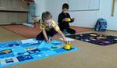
</a>

* Stránky www.code.org - 4. lekce, absolutní pohyb po mapě
* Beebot
    * pohyb všemi směry
    * zápis programu [na papír](2019-04-beebot-program.ods)
    * domácí úkol: tvorba "skinu" (převleku) pro beebota [odkaz](https://blog.tts-group.co.uk/wp-content/uploads/2019/03/Bee-Bot_Jacket.pdf)

## 5. hodina

<a href="2019-05-beeboti.jpg">
    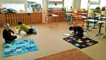
</a>

* Stránky www.code.org - 4. lekce, absolutní pohyb po mapě
* Beebot
    * souřadnice/poloha na mapě
    * pohyb všemi směry
    * test "skinů"

## 6. hodina

* Beebot - procvičování souřadnice/polohy, pohyb všemi směry a zápis programů
* Stránky www.code.org - 4. a 5. lekce, absolutní pohyb po mapě a debugging (krokování)
* Bonus: Aktivity z gcompris pro lepší ovládání myši

## 7. hodina

<a href="2019-07-beebot-soutez.jpg">
    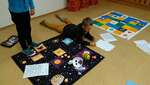
</a>
<a href="2019-07-code.org.jpg">
    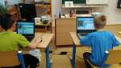
</a>

* Beebot
    * dokončení zápisu programů
    * [tahák](2019-07-beebot-navigace.pdf)
    * soutěž, vyhrál tým Vojtů
* Stránky www.code.org - 4. a 5. lekce, absolutní pohyb po mapě a debugging (krokování)

## 8. hodina

<a href="2019-08-cubetto.jpg">
    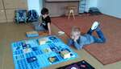
</a>

* Stránky www.code.org - 7. lekce - sběr nektaru a výroba medu
* Cubetto - seznámení s robotem, používání žetonků k programování, hra "koukám a vidím"

## 9. hodina

<a href="2019-09-st-nicolas.mp4">
    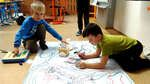
</a>
<a href="2019-09-st-nicolas-cards.jpg">
    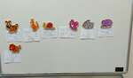
</a>
<a href="2019-09-st-nicolas-parallel-execution.jpg">
    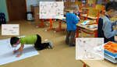
</a>

* Mikuláš (<a href="2019-09-st-nicolas-cards.pdf">kartičky</a>, <a href="2019-09-st-nicolas-hat.pdf">čepice</a>, <a href="2019-09-st-nicolas.dxf">zdroj librecad</a>)
    * Použití kartiček k určení úloh, závislostí a paralelnímu vykonávání
    * Tvorba mapy a "herců"
    * Navigace a synchronizace Ozobotů (čerti), Cubetta (Mikuláš) a Beebota (Anděl)

## 10. hodina

<a href="2019-10-adventni-kalendar.jpg">
    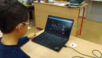
</a>

* Cubetto - pohyb po mapě <a href="2019-10-cubetto-navigace.jpg">pomůcka</a>
* www.code.org - 7. lekce - sběr nektaru a výroba medu
* bonus - představení <a href="https://decko.ceskatelevize.cz/advent">adventního kalendáře</a> od české televize, k dnešnímu dni mohu doporučit aktivity ze 3., 7., 1. a 9. dne.

## 11. hodina

<a href="2019-11-koleda.mp4">
    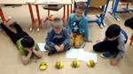
</a>

* Vánoční hodina - Beeboti hrají koledy (<a href="2019-11-koledy.pdf">pracovní sešit</a>)

## 12. hodina

* Programování "lidského" robota
    * programování učitele (demonstrace že počítač bezmyšlenkovitě splní zadaný úkol)
    * programování spolužáka (hravá forma pochopení rozdílných interpretací zadaných příkazů)

## 13. hodina

<a href="2019-13-sipkovana.jpg">
    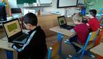
</a>
<a href="2019-13-ozobot-nastavce.jpg">
    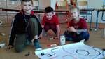
</a>

* "Šipkovaná" na webu <a href="https://www.umimeprogramovat.cz/sipkovana/">Umíme programovat</a>
* Bonus - osahání si nových nástavců na Ozoboty

## 14. hodina

<a href="2019-14-labyrint.jpg">
    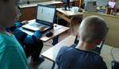
</a>

* Soutěž:
    * Speedrun "Šipkované" na webu <a href="https://www.umimeprogramovat.cz/sipkovana/">Umíme programovat</a>
    * Cubetto:
        * opakování
        * s překážkou (objeď moře)
        * s omezeným počtem bloků
        * počáteční a koncová podmínka (opakovaný start)
        * funkce
    * Labyrint v Gcompris jako pomocné hodnocení

## 15. hodina

* Cubetto - funkce
* Mario Teaches Typing - psaní všemi deseti na klávesnici

## 16. hodina

<a href="2019-16-rozebirani.jpg">
    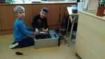
</a>
<a href="2019-16-skladani.jpg">
    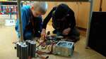
</a>
<a href="2019-16-spousteni.jpg">
    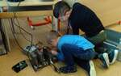
</a>

* Skládání počítače
    * <a href="2019-16-pocitac-komponenty.png">Co tvoří počítač</a> <a href="2019-16-pocitac-komponenty.dxf">(zdroj)</a>
    * Rozebrání z krabice
    * Složení, oživení a test pomocí <a href="https://bruxy.regnet.cz/web/linux/EN/housenka-bash-game/">housenky</a>
    * Ukázka, co dělá processor bez chladiče (termal-throttling)

## 17. hodina

<a href="2019-17-hdd1.jpg">
    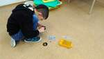
</a>
<a href="2019-17-hdd2.jpg">
    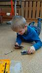
</a>

* Mario Teaches Typing - psaní všemi deseti na klávesnici
* www.code.org - 7. - 9. lekce - včelka a umělec
* Bonus: rozebírání HDD

## 18. hodina

<a href="2019-18-microbit1.jpg">
    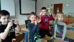
</a>
<a href="2019-18-microbit2.jpg">
    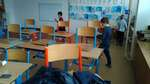
</a>

* www.code.org - lekce 8. a 10. - umělec
* představení BBC Micro:bit - hledání pokladu
  * [vysílač](https://makecode.microbit.org/_5oiLq9hf0Acf)
  * [přijímač](https://makecode.microbit.org/_7AmRg5CyLcLX)

## 19. hodina

* cykly
  * tleskací písnička z code.org (<a href="2019-19-pisnicka.pdf">zdroj</a>)
  * hradní věž (<a href="2019-19-kostky.pdf">zdroj</a>, <a href="2019-19-kostky.ods">spreadsheet</a>)

## 20. hodina

* cykly
  * www.code.org - lekce 13

## 21. hodina

* Z důvodu COVID-19 domácí cvičení na téma cykly [zde](2019-21-domaci-cviceni.pdf)

## 22. hodina

* Videokonference [návod na připojení](../media/talky-navod.mp4)
  * Řešení domácího cvičení ze 22. hodiny
  * Zadání nového domácího cvičení na téma robomise a kostičky [zde](2019-22-domaci-cviceni2.pdf)

## 23. hodina

<a href="2019-23-kosticky2.jpg">
    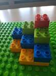
</a>
<a href="2019-23-kosticky3.jpg">
    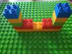
</a>

* Videokonference [návod na připojení](../media/talky-navod.mp4)
  * Robomise kdo kam dojde (L1, L1, L2)
  * Dovysvětlení kostiček ze zadání 2 a pár ukázek
* Domácí úkol
  * Robomisi do úrovně L2 (včetně)
  * Kostičky ze zadání 2 [zde](2019-22-domaci-cviceni2.pdf)
* Příští týden se budeme věnovat [zadání 3](2019-23-domaci-cviceni3.pdf) ale prosím nepředbíhat.

## 24. hodina

<a href="2019-24-kosticky.jpg">
    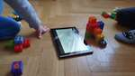
</a>

* Videokonference [návod na připojení](../media/talky-navod.mp4)
  * Robomise - vysvětlili jsme si, jak na cykly s počtem opakování (úroveň L3)
  * Kontrola kostiček ze [zadání 2](2019-22-domaci-cviceni2.pdf) a ukázka rozdílů mezi řezem a pohledem
  * Vysvětlení kostiček ze zadání [zadání 3](2019-23-domaci-cviceni3.pdf)
* Domácí úkol
  * Pokuste se dodělat zbylé dvě zadání kostiček ze [zadání 3](2019-23-domaci-cviceni3.pdf), připomínám, že řešení prvního bylo písmeno "B"
  * Projděte si robomisi úroveň L3. Není to vůbec jednoduché a pozor na povolený počet bločků. V případě, že dostupné bločky zešednou a nelze je uchopit, dosáhli jste limit a je potřeba nějaké bločky z kódu odstranit. Klíč je ve vhodném používání cyklů. Pokud by to dělalo problémy, pokračujte dál a v další hodině můžeme probrat problematické levely.
  * Pokud vše stihneme projít, mám pro Vás připravené [zadání 4](2019-24-domaci-cviceni4.pdf) ale nepředbíhejte. Vše si vysvětlíme v hodině.

## 25. hodina

<a href="2019-25-kosticky.jpg">
    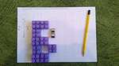
</a>

* Videokonference [návod na připojení](../media/talky-navod.mp4)
  * Předvedení řešení kostiček ze zadání [zadání 3](2019-23-domaci-cviceni3.pdf)
  * Minecraft z code.org

## 26. hodina

* Videokonference [návod na připojení](../media/talky-navod.mp4)
  * Vysvětlení událostí a prvních několik lekcí z "Taneční večírek" na code.org
  * Doplň řadu ze [zadání 4](2019-24-domaci-cviceni4.pdf) a lehké upozornění na existenci binární soustavy
  * Vysvětlení domácího úkolu "Hrací kostky" ze [zadání 5](2019-26-domaci-cviceni5.pdf)

## 27. hodina

<a href="2019-27-kostka.jpg">
    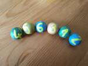
</a>

* Videokonference [návod na připojení](../media/talky-navod.mp4)
  * Maty se pochlubil svými obrázky z Minecraftu (Wow)
  * Konzultace výsledků hodů kostek a něco málo k pravděpodobnosti (list "Kostka 6-vyplnene" [ods](2019-27-hody-kostkou.ods) [xlsx](2019-27-hody-kostkou.xlsx))
  * Pravděpodobnost určité kartičky ze hry "Kvak!" (uhádni, co bude další kartička, průběžná aktualizace pravděpodobnosti balíčku - list "Žabky-vyplnene" [ods](2019-27-hody-kostkou.ods) [xlsx](2019-27-hody-kostkou.xlsx))
  * Člověče nezlob se "Mat-Fyz" edice, popis [zde](2019-27-domaci-cviceni6.pdf)
* [Domácí úkol](2019-27-domaci-cviceni6.pdf)
  * Člověče nezlob se "Mat-Fyz" edice či jakákoliv jiná deskovka s přidanými pravidly
  * Všímat si pravidel typu "Když NĚCO tak NĚCO", příště budeme programovat hru Flappy, kde budeme podobná pravidla definovat.

## 28. hodina

* Videokonference [návod na připojení](../media/talky-navod.mp4)
  * Maxík se pochlubil svými obrázky z Minecraftu (Paráda)
  * Naprogramování hry Flappy pomocí tutoriálu na [www.code.org](https://studio.code.org/flappy/1) viz. [domácí úkol 6](2019-27-domaci-cviceni6.pdf)

## 29. hodina

<a href="2019-29-miny.jpg">
    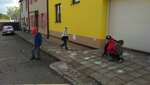
</a>
<a href="2019-29-zabky.jpg">
    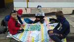
</a>

* Venku
  * Hra miny
    * Cílem je projít bludiště a zapamatovat si správnou trasu
    * Naším cílem bylo vytvořit reprezentaci trasy a předat ji spoluhráčům, aby se bezpečně dostali přes minové pole
    * Reprezentace pomocí: mapy (+orientace), programu (šipek) a binárních čísel (serializace řádků)
  * Hra "Kvak!"
    * Pravidla vysvětlena pomocí vývojového diagramu ([pdf](2019-29-zabky.pdf), [odg](2019-29-zabky.odg))
    * Debugging hry pomocí diagramu
    * Lítý a nakonec i bratrovražedný souboj

## 30. hodina

<a href="2019-30-hrm.jpg">
    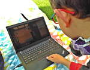
</a>
<a href="2019-30-sifry.jpg">
    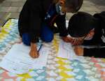
</a>

* Venku
  * Lehký úvod do šifer [pracovní list](2019-30-sifry.pdf)
    * Stihli jsme vysvětlit Cézarovu šifru a šifry pomocí jiných znaků (např. azbuka)
  * [Human Resource Machine](https://tomorrowcorporation.com/humanresourcemachine)
    * Malinko jiný styl programování, blíže k Assembleru
    * [návod](../assets/hrm.pdf) ([odt](../assets/hrm.odt))

## 31. hodina

* Venku
  * Pokračování [Human Resource Machine](https://tomorrowcorporation.com/humanresourcemachine)
    * Malinko jiný styl programování, blíže k Assembleru
    * [návod](../assets/hrm.pdf) ([odt](../assets/hrm.odt))
  * Lehký úvod do šifer [pracovní list](2019-30-sifry.pdf)
    * Skrývání zpráv do textu či obrázku (lehký úvod do steganografie)

## 32. hodina

<a href="2019-32-beebots.jpg">
    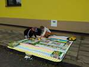
</a>

* Venku
  * Beeboti
    * Opakování
    * Hra - popiš místo / vysvětli, proč je tvá odpověď správná
  * Hra "Kvak!" - děti prostě moc chtěly
  * Bonus - inspirace na příští rok - pásek z ws2812 RGB diod řízený Micro:bitem

* * * * * * * * *

<a name="footnote1">1</a>: Dle psychologa [Jeana Piageta](https://cs.wikipedia.org/wiki/Jean\_Piaget)
nelze děti mladší 6-7 let učit systematické vědy, neboť se nacházejí
ve stádiu `názorového (prelogického) myšlení`, které ještě plně
nerespektuje logiku. Ukázka experimentu je ke shlédnutí například
[zde](https://www.youtube.com/watch?v=tQLpysTbFso) (doporučuji vyzkoušet),
výuka mateřského jazyku začíná také daleko dříve, než je děťátko schopné
jej pochopit a přirozeně se vytváří návyky a spoje, jež jednou vedou v
schopnost mluvit a myslet v daném jazyce. Bilingvální výchova pak vede
ke schopnosti mluvit a myslet ve více jazycích. Proto věřím, že správným
přístupem lze začít daleko dříve a sám využívám logické hry, roboty i
počítač ke hře a vlastně i výuce svých dětí takřka od narození.

